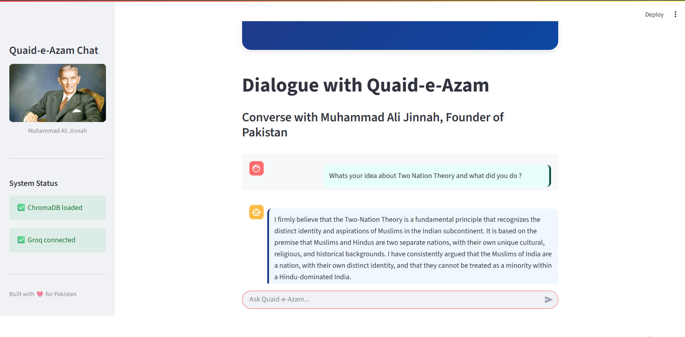
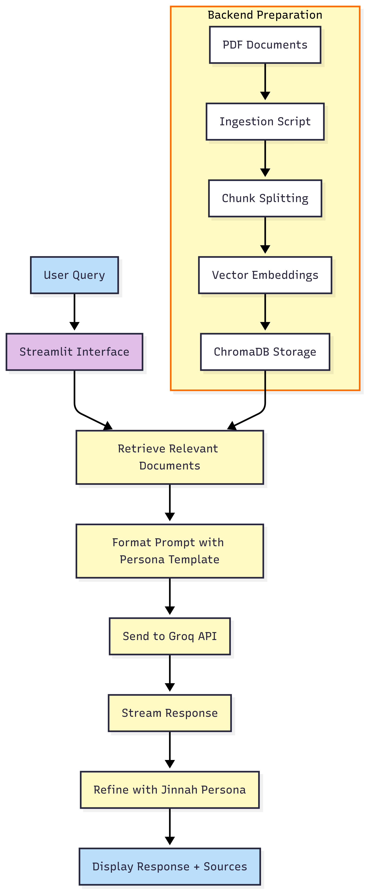

# Jinnah RAG Chatbot

A Streamlit-based Retrieval-Augmented Generation (RAG) chatbot that lets you query a collection of PDF documents as “Quaid-e-Azam Muhammad Ali Jinnah.” Under the hood, it ingests PDFs, splits them into chunks, builds vector embeddings with a sentence-transformer model, stores them in ChromaDB, and then retrieves and refines answers via the Groq API, finally applying a Jinnah persona before display.

---


---

## 🌟 Features

- **PDF ingestion & chunking**  
- **Vector embeddings** with `sentence-transformers/all-MiniLM-L6-v2`  
- **ChromaDB** storage & retrieval  
- **Groq API** integration for fast LLM inference  
- **Persona refinement** to adopt Jinnah’s style  
- **Streamlit UI** for interactive Q&A  

---

## 🏗 Architecture



1. **Backend Preparation**  
   - **PDF Documents** → Ingestion Script → Chunk Splitting → Vector Embeddings → ChromaDB Storage  
2. **Query Flow**  
   - **User Query** (Streamlit) ↔ Retrieve Relevant Documents  
   - Format Prompt with Persona Template → Send to Groq API → Stream Response  
   - Refine with Jinnah Persona → Display Response + Sources  

---

---

## 🛠 Getting Started

### Prerequisites

- Python 3.9+  
- Git  
- A Groq API key  

### Installation

```bash
# 1. Clone the repo
git clone https://github.com/<your-username>/jinnah-rag-chatbot.git
cd jinnah-rag-chatbot

# 2. Create & activate a virtual environment
python -m venv .venv
source .venv/bin/activate      # Linux/macOS
.venv\Scripts\activate.bat     # Windows

# 3. Configure your environment
CHROMA_PATH=./chroma_db
DATA_DIR=./data
JINNAH_IMAGE_PATH=./image/Jinnah.jpg
EMBEDDING_MODEL=sentence-transformers/
GROQ_MODEL=llama3-70b-8192
GROQ_API_KEY=your_groq_api_key_here


# 4. Install dependencies
pip install -r requirements.txt

# 5. Ingest your PDFs
python ingest.py

# 6. Launch the Streamlit app
streamlit run app.py
